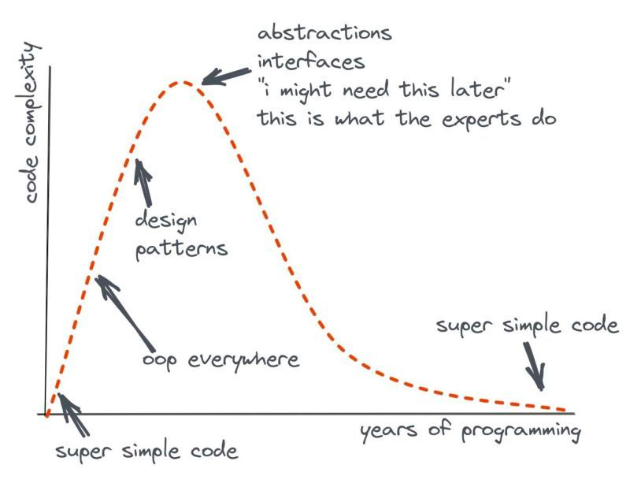

# Java persistence mastering

1. Business
2. Isolation
3. Performance

## Business
  *The reason that we’re coding is the goal.*

DDD: 

- Bringing the code close to the business.
- There are tactical and strategic perspectives
- Strategic: it’s a business language: Bounded Context, ubiquitous language, context Maps.
- Tactical: implementation, classes, and modules.

Patterns: 

- Entities: Anything with continuity through a life cycle and distinctions independent of attributes essential to the
  application’s user.
- Aggregator: A DDD aggregate is a cluster of domain objects that can be treated as a single unit.
- Value Object: Value Object is an object that represents a concept from your problem Domain.
- Services: is used to perform domain operations and business rules
- Repository: is used to access data from persistent stores.

## Isolation
  *Abstraction can effectively combat complexity and scale because it shrinks problems, and smaller problems are easier to reason about it.*

- Keep the business safe from technology.
- Hexagonal architecture
- Ports and Adaptors
- Clean Architecture

### Layers

Benefits:

- Unstructured Code Monolith
- Modular Monolith
- Layered Architecture
    - Mapper
    - DAO
    - Repository

Disadvantages:

- More Work
- More code to maintain
- More bugs

## Performance
  *Object-relational impedance mismatch*

Take advantage of the database:

- NoSQL
    - Key-value
    - Wide-column
    - Document
    - Graph
    - Time Series
    - Even more
- SQL
- NewSQL
- CAP
    - PACELC

